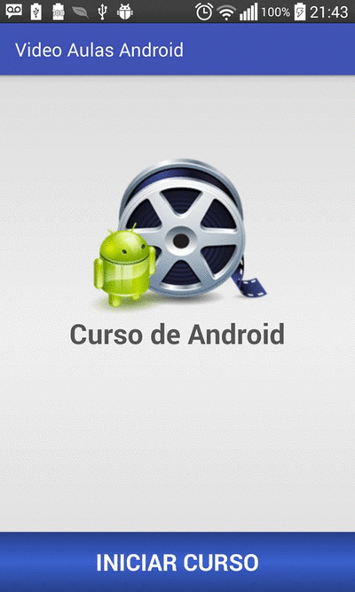

# Video Aula Android

## Visão Geral

## Descrição: 
- Este app tem por objetivo disponibilizar aos usuários aprenderem por meio de vídeo aulas a programarem em Android. 
- Neste projeto foi utilizado o "YouTube Android Player" para carregar os vídeos diretamente do YouTube.

## Objetivos Futuros:
- Disponibilizar para os usuários cadastrarem suas próprias vídeo aulas;
